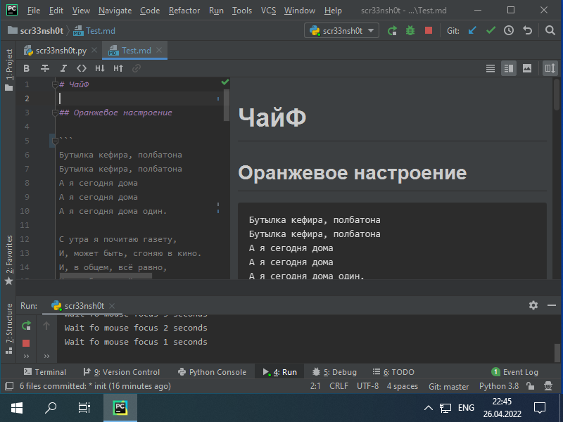
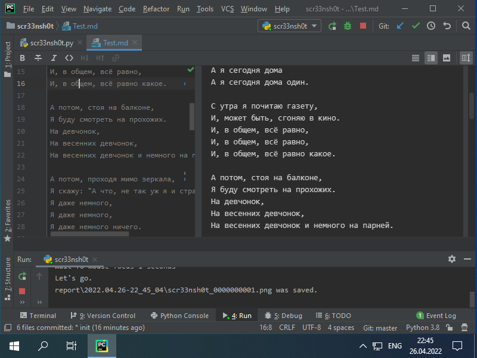
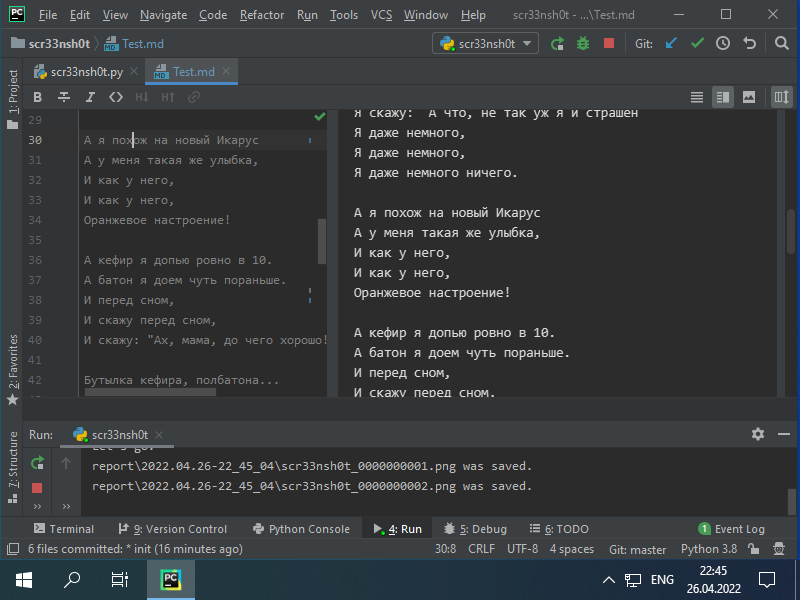
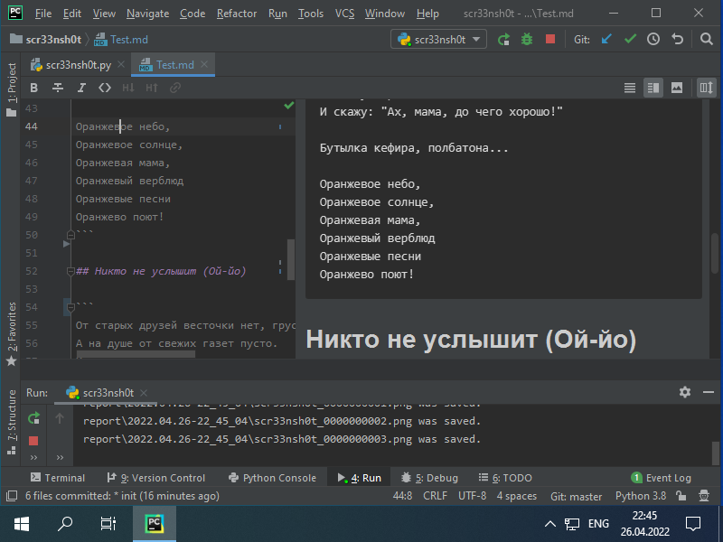
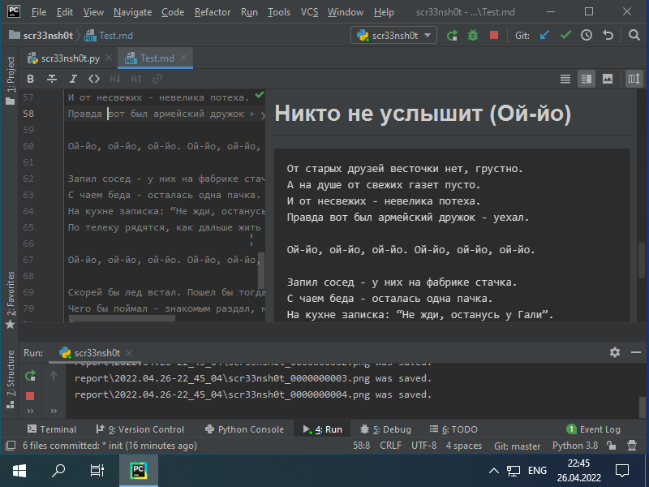
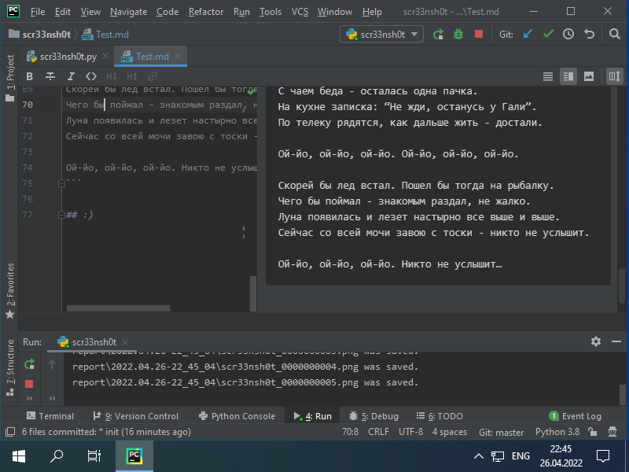

# Scr33nsh0t

Auto make screenshots with interactive scrolling.

## How does it work

```
Waiting you for some time (10 sec.) to window focus -> 
 -> screen shot ("print screen" and "save") -> page down -> step sleep (2 sec.) -> 
 -> screen shot ("print screen" and "save") -> page down -> step sleep (2 sec.) -> 
 -> screen shot ("print screen" and "save") -> page down -> step sleep (2 sec.) -> 
 -> ... -> stop by step count limit or unlimit run.
```
## How to run

Install the requirements

```shell script
python3 -m pip install -r requirements.txt
```

Must be run as: `python3 scr33nsh0t.py <step_count>`.

You can run at terminal or command line, not at PyCharm :) Images below are just examples.


Example: 
```shell script
python3 scr33nsh0t.py 100
```

Example unlimit: 
```shell script
python3 scr33nsh0t.py 0
```

Default <step_count> value is 10.

Put focus into scrolled window for screenshoting, like: text file, PDF-book, web-browser or other.

At parallel at output will be printed:

```text
Wait fo mouse focus 10 seconds
Wait fo mouse focus 9 seconds
Wait fo mouse focus 8 seconds
Wait fo mouse focus 7 seconds
Wait fo mouse focus 6 seconds
Wait fo mouse focus 5 seconds
Wait fo mouse focus 4 seconds
Wait fo mouse focus 3 seconds
Wait fo mouse focus 2 seconds
Wait fo mouse focus 1 seconds
Let's go.
```

and after screenshots will be started (look at line numbers increase).

```
report\2022.04.26-22_33_10\scr33nsh0t_0000000001.png was saved.
```

```
report\2022.04.26-22_33_10\scr33nsh0t_0000000002.png was saved.
```

```
report\2022.04.26-22_33_10\scr33nsh0t_0000000003.png was saved.
```

```
report\2022.04.26-22_33_10\scr33nsh0t_0000000004.png was saved.
```

```
report\2022.04.26-22_33_10\scr33nsh0t_0000000005.png was saved.
```

```
report\2022.04.26-22_33_10\scr33nsh0t_0000000006.png was saved.
```


## :)